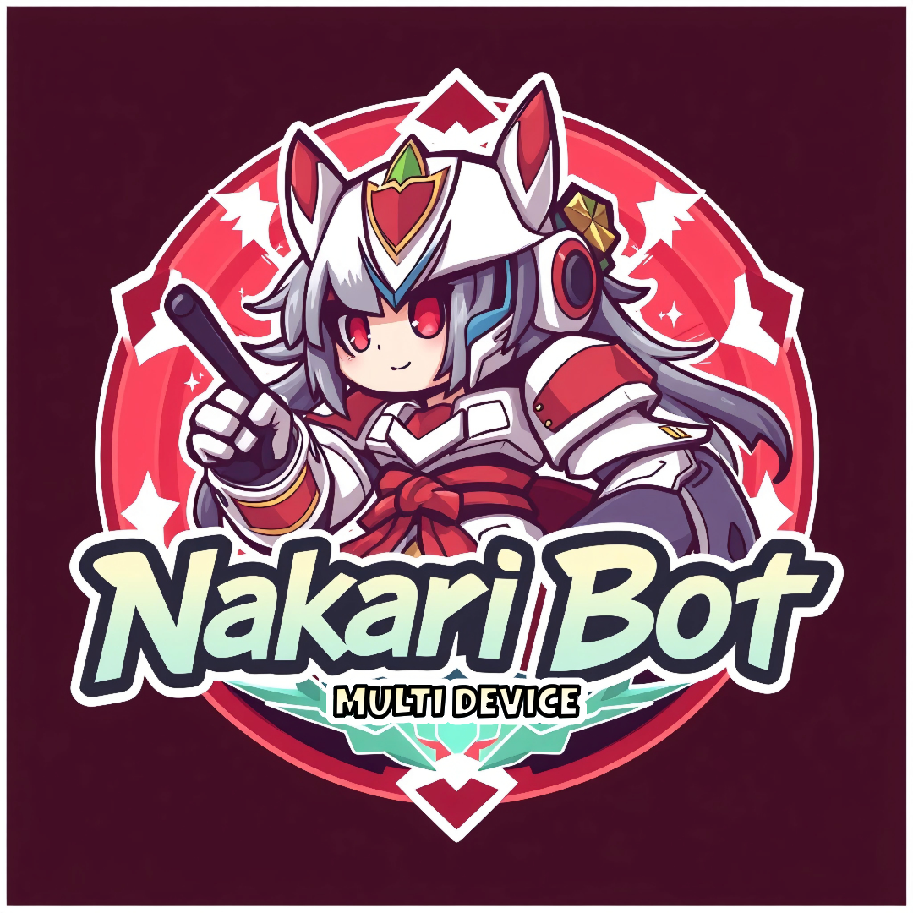

<div align="center">

  
  <h1>Nakari Multidevice Bot WhatsApps</h1>
  
  <p>
    Nakari Multidevice This bot is a multifunctional bot and there are many commands available and of course it is free to use and change the code. 
  </p>

------
  
  
<!-- Badges -->
[](https://github.com/davenwoody/Nakari-Bot/graphs/contributors)
[](https://github.com/davenwoody/Nakari-Bot/network/members)
[](https://github.com/davenwoody/Nakari-Bot/stargazers)
[](https://github.com/davenwoody/Nakari-Bot/issues)
   
<h4>
    <a href="https://github.com/davenwoody/Nakari-Bot/">View Demo</a>
  <span> · </span>
    <a href="https://github.com/davenwoody/Nakari-Bot/">Documentation</a>
  <span> · </span>
    <a href="https://github.com/davenwoody/Nakari-Bot/issues/">Report Bug</a>
  <span> · </span>
    <a href="https://github.com/davenwoody/Nakari-Bot/issues/">Request Feature</a>
  </h4>
</div>

<br />

## :star2: About the Project
Nakari Bot is a multifunctional WhatsApp bot designed to operate across multiple devices. It is an open-source project, allowing users to freely utilize and modify the code according to their needs. The bot is hosted on GitHub, where it has garnered attention from developers and users alike.

## Key Features

Multidevice Support: Nakari Bot is designed to work seamlessly on multiple devices, making it versatile for users who operate on different platforms.

Extensive Command List: The bot comes with a variety of commands that enhance its functionality, allowing users to perform numerous tasks efficiently.

Open Source: Being an open-source project, Nakari Bot encourages community contributions. Users can fork the repository, suggest features, and report issues, fostering a collaborative environment.


## How to install and run bot

### Steps to Start Nakari-Bot Using NPM

1. **Clone the Repository**
   - First, you need to clone the Nakari-Bot repository to your local machine. Use the following command:
   ```bash
   git clone https://github.com/davenwoody/Nakari-Bot.git
   ```

2. **Navigate to the Project Directory**
   - After cloning is complete, navigate into the project directory:
   ```bash
   cd Nakari-Bot
   ```

3. **Install Dependencies**
   - Run the following command to install all the required dependencies:
   ```bash
   npm install
   ```

4. **Start the Bot**
   - Once all dependencies are installed, you can start the bot with the command:
   ```bash
   npm start
   ```

### Additional Notes

- Make sure you have Node.js and npm installed on your system.

If you have any further questions or need additional assistance, feel free to ask!

------

#### Supports Me
<a href="https://sociabuzz.com/dvaxsenzu/tribe" target="_blank">
</a>


